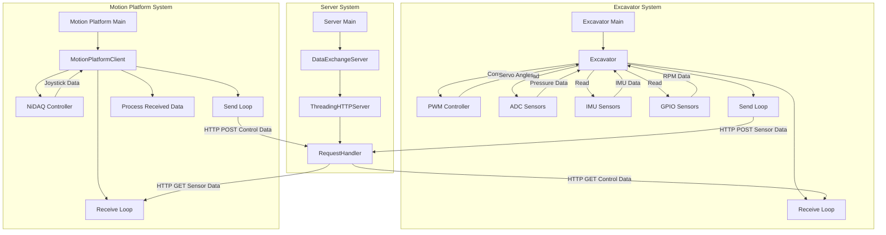
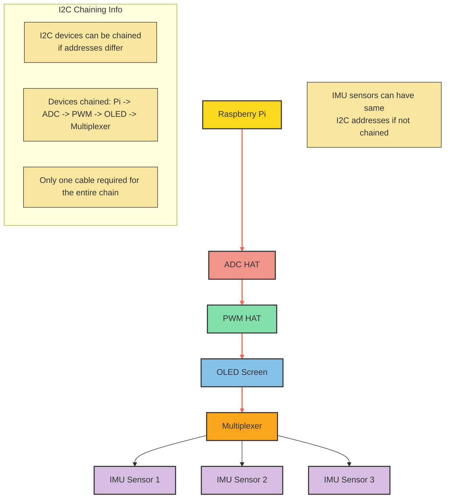

# Documentation

This repository contains the documentation for various components revolving around the project.
For more coding-specific information, please see "Excavator" and "MotionPlatform" -repositories.

